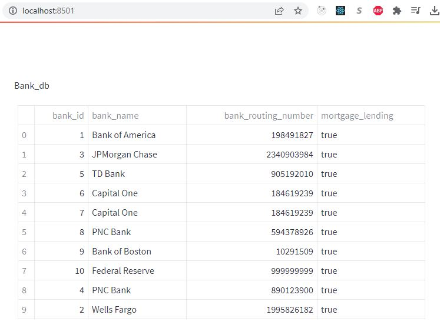
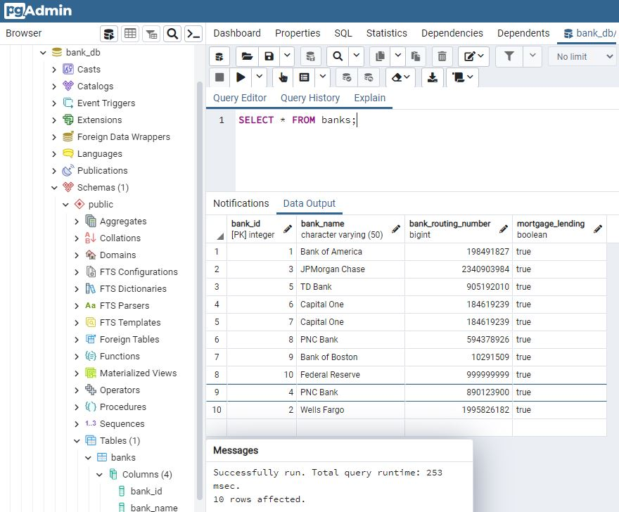

# Connect PostgreSQL DB to Streamlit

Streamlit documentation: [Streamlit](https://docs.streamlit.io/knowledge-base/tutorials/databases/postgresql)

## Local host streamlit app.



PostgreSQL documentation: [PostgreSQL](https://www.postgresql.org/docs/)

## Local Database on pg_admin



## Running Project

1. Clone repo locally.
2. Create environment and open project.
3. Install packages in requirements.txt
4. Create database and make a connection (follow docs above)
5. Run in terminal:

        ```streamlit run app.py```
